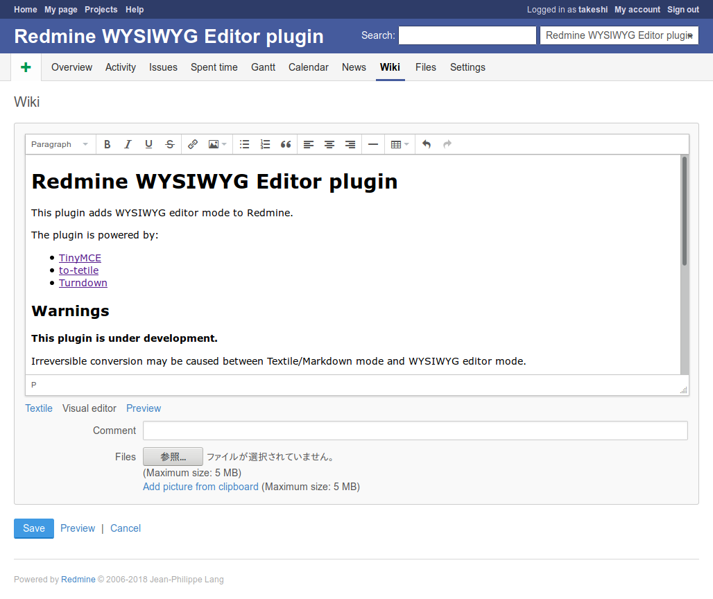

[](https://github.com/taqueci/redmine_wysiwyg_editor/actions/workflows/test.yml)
[](https://app.travis-ci.com/github/taqueci/redmine_wysiwyg_editor)

# Redmine WYSIWYG Editor plugin

This plugin adds WYSIWYG editor mode to Redmine.

This plugin works with Redmine 3.3.0 or later.



The plugin is powered by:
* [TinyMCE](https://www.tinymce.com/)
* [to-textile](https://github.com/cmroanirgo/to-textile)
* [Turndown](https://github.com/domchristie/turndown)

## Warnings

**This plugin is under development.**

Irreversible conversion may be caused between Textile/Markdown mode and
WYSIWYG editor mode.

Since version 0.21.0, the visual editor is disabled as default.
If you have many existing projects,
you can enable by executing on Rails console:
```ruby
Project.all.each { |p| p.enable_module!(:visual_editor) }
```

## Installation

1. Clone or copy files into the Redmine plugins directory
2. Restart Redmine
3. Enable "Visual editor" in project module settings

## FAQ / Errors

### Custom field

The visual editor mode is available in long text custom field
with Redmine 4.1.0+ by enabling:
* Text formatting
* Full width layout

### you get a 404 on plugin_assets folder

e.g. under ubuntu the plugin_assets is not automatically provided in the apache passenger config. So you need to add this directory too

#### Ubuntu 18.04 / 20.04

```
 Alias "/redmine/plugin_assets/" /var/cache/redmine/default/plugin_assets/
 <Directory "/var/cache/redmine/default/plugin_assets">
    Allow from all
    Options -MultiViews
    Require all granted
 </Directory>
```


## License

This plugin is released under the terms of GNU General Public License,
version 2.

## Author

Takeshi Nakamura
